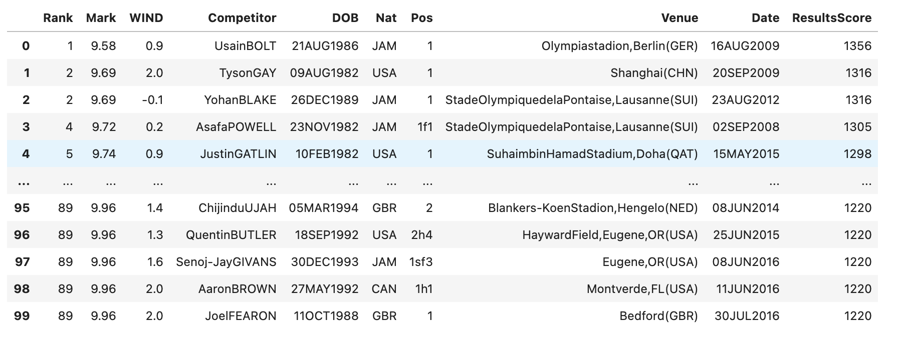
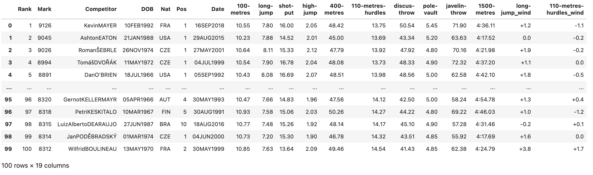

# make-athletes-toplist

This code can generate the athletes' top-list made of data sourced by the World Athletics web site. You sholud choose some attributes.

## EXAMPLE OF OUTPUT
### men-100m


### men-decathlon


# RUN
```
source run.sh
```

To change attributes, edit run.sh.
## Example of internal of run.sh
```
python main.py \
          --EVENT decathlon \
          --ENVRMNT outdoor \
          --GENDER men \
          --AGE senior \
          --NUMBER 200 \
          --ODIR ./result/ \
```
# Attributes 

## Event
Chose 100-metres, 400-metres, long-jump, shot-put, decathlon ,50-kilometres-race-walk, or etc.

e.g.
```
--EVENT decathlon
```

## Environment
Chose outdoor or indoor.

e.g.
```
--ENVRMNT outdoor
```

## Gender
Choose men or women.

```
--GENDER men
```

## Age
Choose senior, U20, or U18

e.g.
```
--AGE senior
```

## Number of competitors in your list
Decide the number of competitors in your list.

e.g.
```
--NUMBER 200
```

## Output Directory
Set output directory.

e.g.
```
--ODIR ./result/
```
